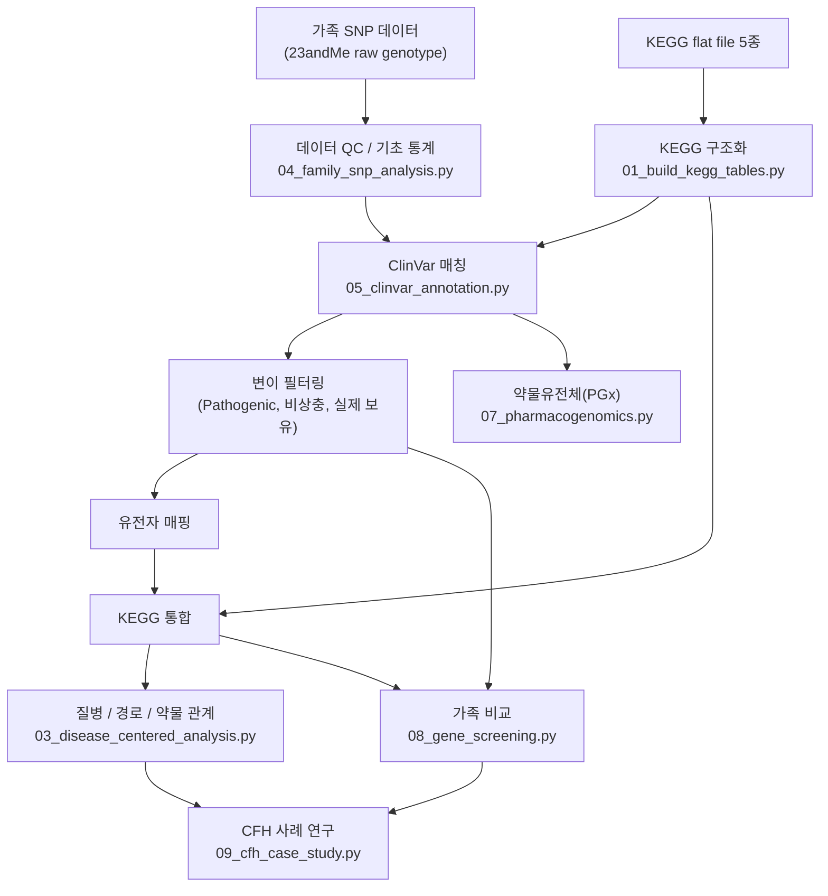
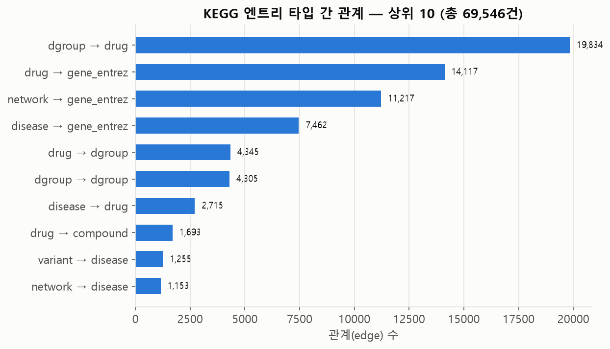
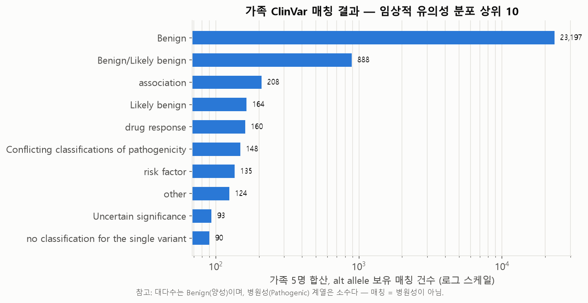

# Family Genome × KEGG Knowledge Integration

AI-assisted family SNP analysis integrating ClinVar and KEGG disease–gene–pathway–drug
relationships

## 1. Project Overview

이 프로젝트는 다섯 명으로 구성된 한 가족(Father/Mother/Child 1/2/3)의 23andMe SNP 데이터를
NCBI ClinVar와 rsid 단위로 매칭해 실제 임상 유의성 주석을 붙이고, 이를 KEGG의 질병-유전자-
경로-약물 관계형 데이터와 독립적으로 교차검증한다. KEGG 원본 flat file 5개를 직접 파싱해
69,546건의 구조화된 관계형 데이터로 만들고, 그 위에서 질병 중심 약물 재창출 후보 탐색과
동반질환 패턴 분석을 수행한다. 마지막으로 가족 수준에서 병원성 변이 보유 패턴과
약물유전체(PGx) 마커를 비교해, KEGG 지식 그래프까지 확장되는 하나의 분석 파이프라인으로
연결한다.

**이 프로젝트는 연구·가설 생성 프로젝트이며, 임상 진단 파이프라인이 아니다.** 모든
"병원성 변이", "재창출 후보", "PGx 매칭" 결과는 스크리닝 수준의 참고 정보이며, 실제 임상
적용 전에는 반드시 의사·약사·유전상담사와 상의해야 한다.

## 2. Research Questions

1. 가족 SNP 데이터를 ClinVar의 임상 주석과 실제로 연결할 수 있는가?
2. ClinVar로 주석된 변이를 KEGG의 질병·경로 지식과 독립적으로 연결할 수 있는가?
3. 가족 수준의 유전형 패턴에서 해석 가능한 유전·공유 패턴을 관찰할 수 있는가?
4. 알려진 약물유전체(PGx) 마커를 이 가족에서 식별할 수 있는가?
5. 생물학적 지식 그래프(KEGG)를 이용해 변이 목록을 유전자-질병-경로-약물 관계로 확장할 수
   있는가?

## 3. Data Sources

| Source | Data | Role |
|---|---|---|
| KEGG flat file | dgroup / disease / drug / network / variant (5개) | 질병-유전자-경로-약물 관계형 지식 그래프의 원재료 |
| Family SNP (Kaggle) | Father/Mother/Child 1·2·3 23andMe raw genotype | 분석 대상 가족 유전형 |
| NCBI ClinVar | `variant_summary.txt` (GRCh37) | 가족 rsid에 임상 유의성 주석 부여 |

CPIC/FDA는 PGx 결과(VKORC1/CYP3A5/UGT1A1)가 실제 등재 마커인지 **수작업으로 대조**하는 데
사용했을 뿐, 코드가 CPIC API/데이터를 자동으로 조회하지는 않는다(`docs/validation.md` 참고).

## 4. Analysis Pipeline



전체 단계별 입출력과 스크립트는 [`docs/workflow.md`](docs/workflow.md)를 참고.

## 5. Key Results

- KEGG 5개 flat file → **69,546건**의 엔트리 간 관계로 구조화
- 가족 rsid 합집합 **1,117,586개** 중 ClinVar와 **59,501건** 매칭 (대다수는 Benign — 매칭이
  곧 병원성을 뜻하지 않음)
- 가족이 실제 보유한 병원성(Pathogenic, 비상충) 변이 4건(CFH×2, LMNA×1, UGT1A1×1) 중,
  **CFH**(rs460897, rs1061170)만 KEGG 자체 질병 데이터베이스로도 독립적으로 교차검증됨
- 전 가족 공통 약물유전체(PGx) 마커: **VKORC1**(warfarin), **CYP3A5**(tacrolimus),
  **UGT1A1**(irinotecan) — 전부 CPIC/FDA에 실제 등재된 유전자-약물 쌍
- 질병 중심 재창출 후보 탐색: 2,633개 질병 중 673개에서 재창출 후보 5,890건 발견 — 예시로
  간암(H00048) → PI3K/mTOR 억제제 계열, CFH 연결 질병 → Pegcetacoplan/Iptacopan/Danicopan
  (실제 FDA 승인/후기임상 보체억제제)이 방법론적으로 도출됨

> **주의**: ClinVar 매칭 ≠ 병원성 변이, PGx 마커 ≠ 임상 처방 권고, KEGG의 질병 연결 ≠ 진단.
> 각 표현의 정확한 의미는 [`docs/limitations.md`](docs/limitations.md)에 명시돼 있다.

<p align="center">
  
  
</p>

## 6. Featured Case Studies

- **[CFH Family Case Study](results/case_studies/CFH_case_study.md)** — 가족이 보유한
  ClinVar 병원성 변이 중 KEGG 교차검증까지 통과한 유일한 유전자 CFH를 중심으로, 가족 유전형
  비교·KEGG 질병/약물 연결·생물학적 해석을 정리한다.
- **[Pharmacogenomics Case Study](results/case_studies/pharmacogenomics_case_study.md)** —
  전 가족 공통 PGx 마커(VKORC1/CYP3A5/UGT1A1)를 중심으로, 마커 식별과 실제 임상 적용
  사이의 간극(haplotype, 대사자 표현형, CPIC 가이드라인)을 정리한다.

<p align="center">
  
  
</p>

## 7. Validation Strategy

- 원본 데이터 건수(KEGG 엔트리 수, 가족 rsid 합집합 크기 등)를 스크립트 출력과 직접 대조
- rsid 매칭·병합 카디널리티, 결측 genotype, 중복 레코드를 명시적으로 확인
- ClinVar `ReviewStatus`/`NumberSubmitters`를 보존해 리뷰 신뢰도를 결과와 함께 제공
- KEGG를 ClinVar의 "검증"이 아니라 독립적인 지식 소스로 취급해 교차검증
- PGx는 CPIC/PharmGKB 공개 자료와 수작업 대조
- CFH·PGx·재창출 후보 결과를 생물학적 타당성 기준으로 수작업 검토
- 저장소 재구성 과정에서 파이프라인을 재실행해 원래 커밋의 수치와 정확히 일치함을 재확인

자세한 내용은 [`docs/validation.md`](docs/validation.md).

## 8. Repository Structure

```
kegg-family-genome-analysis/
├── data/
│   ├── raw/{kegg, family_snp}/     원본 데이터
│   ├── external/clinvar/           대용량 외부 참조(저장소 미포함, data/README.md 참고)
│   └── processed/                  뒤 단계가 다시 읽는 중간 산출물
├── src/                             파이프라인 스크립트(01~12)
├── results/
│   ├── tables/                     최종/해석용 결과 CSV
│   ├── figures/                    정적 그림(PNG)
│   └── case_studies/               CFH·PGx 사례 연구
├── docs/                            방법론·검증·한계·AI 활용·작업 기록
└── notebooks/portfolio_walkthrough.ipynb
```

## 9. Reproducibility

Python 3.11+

```bash
pip install -r requirements.txt
```

의존 순서를 지키는 전체 실행 순서(저장소 루트에서 실행):

```bash
python src/01_build_kegg_tables.py
python src/01b_extract_variant_genes.py      # 선택
python src/02_analyze_kegg_relations.py
python src/04_family_snp_analysis.py
# NCBI ClinVar variant_summary.txt.gz를 data/external/clinvar/ 에 준비 (data/README.md 참고)
python src/05_clinvar_annotation.py
python src/06_kegg_crossvalidation.py
python src/03_disease_centered_analysis.py
python src/07_pharmacogenomics.py
python src/08_gene_screening.py
python src/09_cfh_case_study.py
python src/10_atc_classification.py
python src/11_dgroup_classification.py
python src/12_generate_figures.py
```

모든 경로는 저장소 루트 기준 상대 경로(`Path(__file__).resolve().parents[1]`)로 계산되므로
실행 위치나 로컬 폴더 구조에 관계없이 동작한다. 단계별 상세 입출력은
[`docs/workflow.md`](docs/workflow.md) 참고.

## 10. AI-Assisted Development

Claude Code was used as an implementation and debugging assistant. Research questions,
biological interpretation, validation strategy, and clinical limitations were determined and
reviewed by the project author. 역할 분담과 검증 방식은
[`docs/ai_assisted_workflow.md`](docs/ai_assisted_workflow.md)에 자세히 설명돼 있다.

## 11. Limitations

- 가족 데이터는 WES/WGS가 아닌 SNP 어레이(23andMe) 기반이라 커버리지가 제한적이다
- 표본 크기가 n=5라 인구 집단 수준의 결론을 낼 수 없다
- 표현형(병력) 정보가 없어 유전형-표현형 상관관계를 임상적으로 검증할 수 없다
- 변이 매칭이 rsid 단위라 chromosome/position/REF/ALT 기반 완전 정규화보다 정밀도가 낮다
- ClinVar "Pathogenic" 표시가 곧 발병을 의미하지 않는다(접합성·침투도·리뷰 신뢰도 등 별도 고려 필요)
- PGx는 마커 식별 수준이며 haplotype/star-allele/대사자 표현형/실제 용량은 계산하지 않는다

전체 내용은 [`docs/limitations.md`](docs/limitations.md).

## 12. Future Improvements

- chromosome/position/REF/ALT 기반 allele-level 정밀 매칭
- GRCh37/GRCh38 등 genome build 간 좌표 변환(liftover) 통합
- ClinVar review status를 정량 가중치로 반영하는 신뢰도 스코어링
- gnomAD 등 인구 집단 대립유전자 빈도 통합
- 가족 유전 패턴에 대한 정식 유전 모델(멘델 분리) 분석
- 가계도 기반(pedigree-aware) 체계적 검증
- PGx haplotype/star-allele 콜링, 대사자 표현형 분류
- CPIC/PharmGKB 데이터 프로그램적 통합(현재는 수작업 대조)
- 표현형/병력 데이터 통합
- WES/WGS로 확장

이 목록은 아직 구현되지 않은 개선 방향이며, 현재 결과가 이를 포함한다고 주장하지 않는다.
