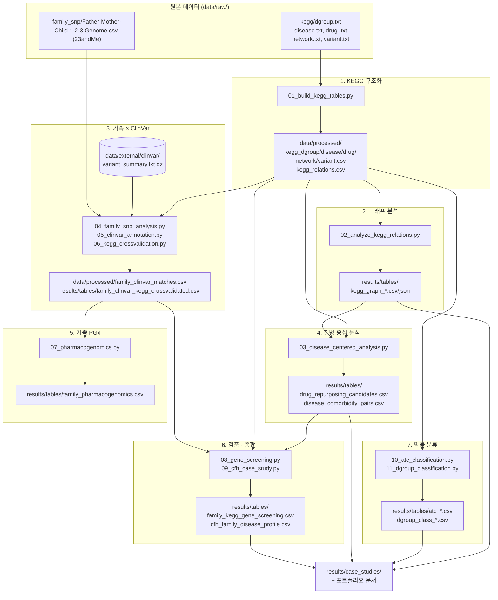

# 워크플로우

KEGG 데이터 구조화부터 가족 SNP 교차분석까지, 전체 파이프라인을 실행 순서대로 정리한다.
각 단계는 이전 단계의 출력을 입력으로 받는다 — 순서를 건너뛰면 뒤 단계가 실패한다.

> 2026-08-21: 저장소를 포트폴리오 구조(`src/` + `data/` + `results/` + `docs/`)로
> 재구성하면서 이 문서도 새 파일명·경로 기준으로 갱신했다. 재구성 이전의 원래 작업 기록은
> [`development_log.md`](development_log.md)에 그대로 남아 있다(그 문서의 경로는 재구성 이전
> 구조 기준이다).

## 전체 흐름



## 단계별 상세

### 0. 폴더 구조
```
kegg-family-genome-analysis/
├── data/
│   ├── raw/{kegg, family_snp}/     원본 데이터
│   ├── external/clinvar/           대용량 외부 참조(저장소 미포함)
│   └── processed/                  뒤 단계가 다시 읽는 중간 산출물
├── src/                             파이프라인 스크립트(01~11, 숫자 = 실행 순서 아님, 아래 참고)
├── results/{tables, figures, case_studies}/
└── docs/
```
파일 배치 기준은 [`../data/README.md`](../data/README.md) 참고.

### 1. KEGG 구조화
| | |
|---|---|
| 입력 | `data/raw/kegg/{dgroup,disease,"drug ",network,variant}.txt` |
| 스크립트 | `src/kegg_flatfile_parser.py`(공용 파서) → `src/01_build_kegg_tables.py` |
| 출력 | `data/processed/kegg_{dgroup,disease,drug,network,variant}.csv`, `kegg_relations.csv` |
| 보조 | `src/01b_extract_variant_genes.py`(선택, 뒤 단계에서 재사용되지 않음) → `results/tables/variant_genes_unique.csv` |

### 2. 그래프 분석
| | |
|---|---|
| 입력 | `data/processed/kegg_relations.csv`, `kegg_*.csv` |
| 스크립트 | `src/02_analyze_kegg_relations.py` |
| 출력 | `results/tables/kegg_graph_type_summary.csv`, `kegg_graph_top_hubs.csv`, `kegg_graph_ego_network.json` |

### 3. 가족 SNP × ClinVar
| | |
|---|---|
| 입력 | `data/raw/family_snp/*.csv`, `data/processed/kegg_{disease,variant,drug}.csv`, `data/external/clinvar/variant_summary.txt.gz`(외부 다운로드) |
| 스크립트 | `src/04_family_snp_analysis.py` → `src/05_clinvar_annotation.py` → `src/06_kegg_crossvalidation.py` |
| 출력 | `results/tables/family_snp_summary.csv`, `data/processed/kegg_disease_gene_panel.csv`, `data/processed/family_clinvar_matches.csv`, `results/tables/family_clinvar_kegg_crossvalidated.csv` |
| 비고 | ClinVar 원본은 GRCh37만 필터링, rsid는 가족 데이터 union(1,117,586개)만 스트리밍 매칭 |

### 4. 질병 중심 분석
| | |
|---|---|
| 입력 | `data/processed/kegg_relations.csv`, `kegg_disease/drug/dgroup/network.csv` |
| 스크립트 | `src/03_disease_centered_analysis.py` |
| 출력 | `results/tables/disease_pathway_genes.csv`, `drug_repurposing_candidates.csv`, `disease_comorbidity_pairs.csv` |

### 5. 가족 약물유전체(PGx)
| | |
|---|---|
| 입력 | `data/processed/family_clinvar_matches.csv`, `kegg_dgroup.csv`, `kegg_drug.csv` |
| 스크립트 | `src/07_pharmacogenomics.py` |
| 출력 | `results/tables/family_pharmacogenomics.csv`, `family_pharmacogenomics_summary.csv` |

### 6. 독립 검증 · 가족 특화 종합
| | |
|---|---|
| 입력 | `data/processed/kegg_disease_gene_panel.csv`, `family_clinvar_matches.csv`, `kegg_relations.csv`, `src/03_disease_centered_analysis.py`의 함수(`kegg_analysis_utils.py` 경유) |
| 스크립트 | `src/08_gene_screening.py`, `src/09_cfh_case_study.py` |
| 출력 | `results/tables/family_kegg_gene_screening.csv`, `cfh_family_disease_profile.csv` |

### 7. 약물 분류 통계
| | |
|---|---|
| 입력 | `data/processed/kegg_drug.csv`, `data/raw/kegg/dgroup.txt`(원본 재파싱) |
| 스크립트 | `src/10_atc_classification.py`, `src/11_dgroup_classification.py` |
| 출력 | `results/tables/atc_top_level_summary.csv`, `atc_subgroup_summary.csv`, `dgroup_class_edges.csv`, `dgroup_class_rollup.csv` |

### 8. 산출
- 사례 연구: [`results/case_studies/CFH_case_study.md`](../results/case_studies/CFH_case_study.md),
  [`pharmacogenomics_case_study.md`](../results/case_studies/pharmacogenomics_case_study.md)
- 시각화: `results/figures/` (파이프라인 개요, KEGG 관계 요약, 가족 ClinVar 요약, CFH 가족
  유전형, PGx 가족 히트맵)
- 노트북: `notebooks/portfolio_walkthrough.ipynb`

## 처음부터 재현할 때 실행 순서

파일명의 숫자 접두사는 "파이프라인 안에서의 위치"를 나타내지만, 01→11 순서가 실제 실행
의존성과 100% 같지는 않다(예: `07_pharmacogenomics.py`는 `05_clinvar_annotation.py`의 출력이
있어야 하고, `10_atc_classification.py`/`11_dgroup_classification.py`는 `04`~`09`와 무관하게
`01`만 있으면 실행 가능하다). 실제 의존 관계를 지키는 실행 순서는 다음과 같다.

```
1)  src/01_build_kegg_tables.py
2)  src/01b_extract_variant_genes.py            (선택)
3)  src/02_analyze_kegg_relations.py
4)  src/04_family_snp_analysis.py
5)  [data/external/clinvar/variant_summary.txt.gz 다운로드 — data/README.md 참고]
6)  src/05_clinvar_annotation.py
7)  src/06_kegg_crossvalidation.py
8)  src/03_disease_centered_analysis.py
9)  src/07_pharmacogenomics.py
10) src/08_gene_screening.py
11) src/09_cfh_case_study.py
12) src/10_atc_classification.py
13) src/11_dgroup_classification.py
```

모든 스크립트는 `python src/스크립트명.py` 형태로, 저장소 루트에서 실행한다(경로는
`Path(__file__).resolve().parents[1]` 기준 저장소 루트 상대 경로라 실행 위치에 관계없이
동작한다). 각 스크립트는 이전 단계의 출력을 그대로 읽으므로, 순서를 지키면 별도 설정 없이
재실행된다.
