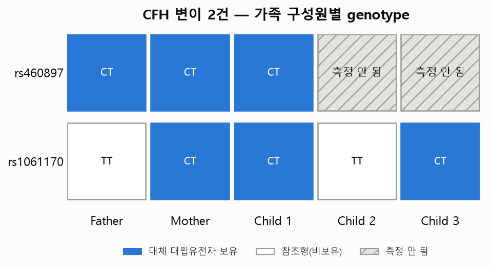

# CFH Family Case Study

> 이 사례 연구는 가설 생성용 스크리닝 결과이며, 개인의 질병 진단이나 위험도를 확정하지
> 않는다. 방법론은 [`docs/methodology.md`](../../docs/methodology.md), 한계는
> [`docs/limitations.md`](../../docs/limitations.md)를 함께 참고할 것.

## 1. CFH가 사례 연구로 떠오른 이유

이 프로젝트의 파이프라인은 다음 순서로 CFH(Complement Factor H)를 걸러냈다:

1. 가족 5명의 rsid(1,117,586개 합집합)를 ClinVar와 매칭한 결과, ClinVar가 **병원성 계열
   (Pathogenic, "Conflicting" 제외)**로 분류하고 **가족 중 누군가 실제로 대립유전자를
   보유**한 변이는 4건이었다 — CFH 2건, LMNA 1건, UGT1A1 1건.
2. 이 4건을 KEGG `variant.txt`가 명시적으로 `DISEASE: H#####` 필드를 등록한 909개
   질병연관 유전자 패널과 교차검증한 결과, **CFH만 통과**했다(`src/06_kegg_crossvalidation.py`).
   LMNA·UGT1A1은 ClinVar에서는 병원성으로 분류돼 있어도 KEGG `variant.txt`에는 해당 맥락의
   명시적 질병 링크가 없어 탈락했다.

즉 CFH는 "흥미로워서" 고른 것이 아니라, 이 프로젝트가 정의한 두 데이터베이스 교차검증
기준을 통과한 유일한 유전자이기 때문에 선정했다.

## 2. 관련 변이

`data/processed/family_clinvar_matches.csv` / `results/tables/family_clinvar_kegg_crossvalidated.csv`
기준으로 확인된 실제 변이 2건:

| rsid | Chromosome:Position(GRCh37) | Ref/Alt | ClinVar ClinicalSignificance | ReviewStatus (제출자 수) |
|---|---|---|---|---|
| rs460897 | 1:196,716,319 | C→T | Pathogenic/Likely pathogenic | criteria provided, multiple submitters, no conflicts (10명) |
| rs1061170 | 1:196,659,237 | C→C(참고용 항목) / C→T(별도 항목, Conflicting) | Pathogenic; risk factor | no assertion criteria provided (1명) |

**주의**: rs1061170은 ClinVar에 두 개의 서로 다른 레코드가 있다 — 이 표에 쓴 "Pathogenic;
risk factor" 레코드(제출자 1명, 무검토)와, 별도의 "Conflicting classifications of
pathogenicity" 레코드(Ref→Alt: C→T). 이 프로젝트는 상충(Conflicting) 레코드는 병원성 후보에서
제외하므로 전자만 채택했다 — 즉 rs1061170의 "병원성" 분류 자체가 제출자 1명·무검토 수준이라
신뢰도가 낮다는 점을 반드시 함께 읽어야 한다. rs1061170은 CFH의 잘 알려진 흔한 다형성인
Y402H에 해당하며, 인구 집단에 넓게 퍼져 있는 변이라 "병원성" 표시만으로 개인의 발병 위험을
판단할 수 없다.

## 3. 가족 유전형 비교

| Variant | Father | Mother | Child 1 | Child 2 | Child 3 |
|---|---|---|---|---|---|
| rs460897 | CT | CT | CT | (측정 안 됨) | (측정 안 됨) |
| rs1061170 | TT | CT | CT | TT | CT |

  

- rs460897은 Child 2·Child 3의 원본 SNP 파일에 해당 rsid 자체가 없다(23andMe 칩 버전 차이로
  측정되지 않은 것으로 추정 — `development_log.md`에 기록된 이형접합률 차이와 같은 원인).
  "변이 없음"이 아니라 "이 칩으로는 측정하지 않음"이다.
- rs460897은 Father/Mother/Child 1이 모두 이형접합(CT)으로 대체 대립유전자(T)를 보유한다.
- rs1061170은 Mother/Child 1/Child 3가 이형접합(CT)으로 대체 대립유전자를 보유하고,
  Father/Child 2는 동형접합 참조(TT)로 확인된다(genotype 표기가 23andMe plus-strand
  기준이라 ClinVar의 C/T 표기와 문자가 일치하지 않을 수 있음 — allele 비교는 문자 포함
  여부로만 계산했다는 방법론상 한계를 유의할 것).

## 4. ClinVar 해석

- **rs460897**: 제출자 10명이 상충 없이 병원성/병원성 가능성 있음으로 합의한 비교적 신뢰도
  높은 항목이다. Atypical hemolytic uremic syndrome(비정형 용혈성요독증후군), Age-related
  macular degeneration(황반변성), Factor H deficiency 등과 연관된 것으로 등록돼 있다.
- **rs1061170**: 제출자 1명·무검토 항목이며, CFH Y402H로 알려진 흔한 다형성이다. "병원성"
  표시가 있다고 해서 이 변이 하나로 발병이 결정되는 것이 아니라, 여러 위험 인자 중 하나로
  다뤄지는 것이 일반적이다 — 이 프로젝트의 필터 기준(Conflicting만 제외)으로는 이 차이가
  자동으로 드러나지 않으므로, review status를 반드시 함께 봐야 한다는 것을 보여주는
  사례이기도 하다.

## 5. KEGG 관계

`src/09_cfh_case_study.py`가 만든 `results/tables/cfh_family_disease_profile.csv` 기준,
CFH는 KEGG `disease.txt`에서 다음 5개 질병과 직접 연결된다:

CFH → **Alternative complement pathway component defects (H00104)**,
**Age-related macular degeneration (H00821)**,
**Atypical hemolytic uremic syndrome (H01434)**,
**Basal laminar drusen (H02108)**,
**C3 glomerulopathy (H02579)**

이 5개 질병 각각에 대해 disease→gene→drug 재창출 후보 로직을 그대로 적용한 결과, 다음과
같은 약물 후보가 나왔다(전부 "이 질병에 아직 공식적으로 연결되지 않았지만, 관련 유전자를
표적하는 약물"이라는 뜻이며 실제 처방 근거가 아니다):

- H00104 → Lampalizumab, Danicopan, Vemircopan (via CFD), Iptacopan/Iptacopan hydrochloride (via CFB)
- H00821 → Iptacopan 계열(via CFB), Pegcetacoplan(via C3), Galegenimab(via ARMD7) 등
- H01434 → Iptacopan 계열(via CFB), Pegcetacoplan(via C3)

Pegcetacoplan · Iptacopan · Danicopan은 실제로 FDA 승인 또는 후기 임상 단계의 보체억제제로,
이 프로젝트의 유전자 기반 재창출 후보 탐색 방법론이 실제 약물 개발 방향과 일치함을
확인할 수 있다 — 다만 이는 "방법론이 그럴듯하게 작동한다"는 확인이지, 가족 개개인에게 이
약물이 필요하다는 뜻이 전혀 아니다.

## 6. 생물학적 해석

CFH가 연결된 5개 질병은 모두 **보체계(complement system)** 관련 질환으로 강하게
클러스터링된다 — 동반질환 분석(`comorbid_diseases_via_shared_gene`)에서도 이 5개 질병이
서로를 상위 동반질환으로 지목한다(예: H01434는 H00821과 유전자 6개를 공유). 이는 CFH가
보체 조절 경로에서 다면발현(pleiotropic) 역할을 한다는 잘 알려진 생물학과 부합하는
결과다.

## 7. 임상적 한계

**이 사례 연구는 질병 진단이나 개인의 위험도를 확정하지 않는다.** 다음을 반드시 함께
고려해야 한다:
- 접합성(이형접합 vs 동형접합)과 침투도(penetrance)에 대한 정보가 이 분석에 없다
- 가족의 실제 병력·증상 데이터가 없어 유전형-표현형 상관관계를 검증할 수 없다
- rs1061170의 병원성 분류는 제출자 1명·무검토 수준으로 신뢰도가 낮다
- Child 2·Child 3는 rs460897이 애초에 측정되지 않아 이 변이에 대해서는 "모른다"가 정확한
  해석이며 "변이 없음"이 아니다
- 실제 임상적 위험 평가는 반드시 의사·유전상담사의 검토를 거쳐야 한다
