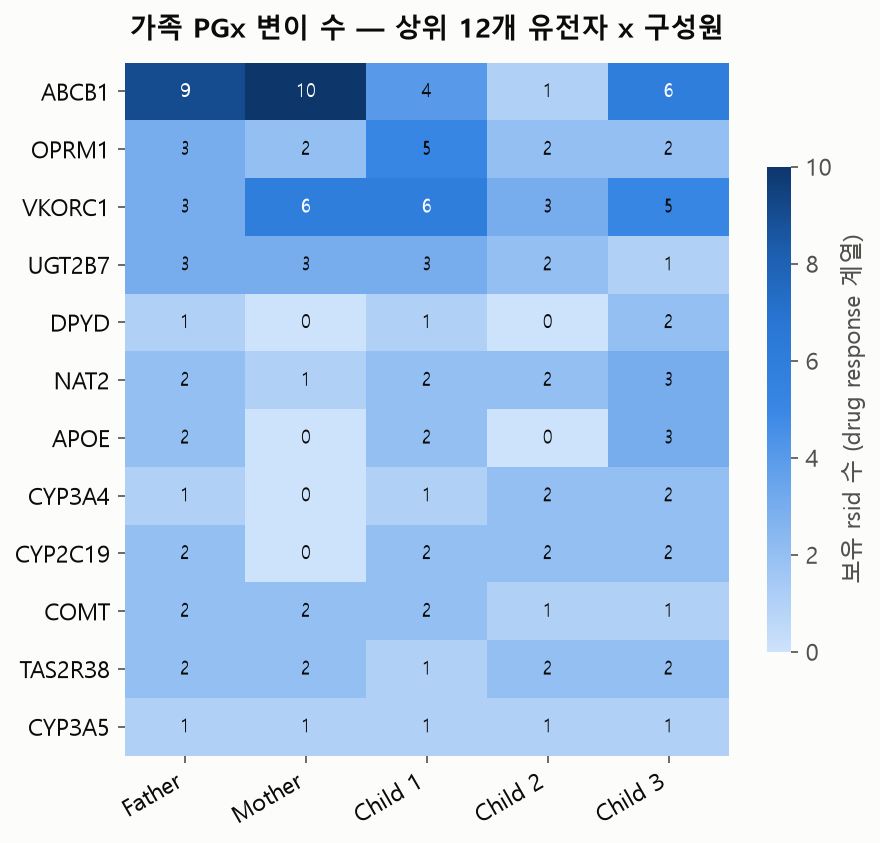

# Family Pharmacogenomics Case Study

> 이 사례 연구는 약물유전체 **마커 식별** 결과이며, 실제 처방 용량이나 약물 선택을 결정하지
> 않는다. star-allele/대사자 표현형 판정 없이는 임상적으로 적용할 수 없다 — 자세한 내용은
> [`docs/limitations.md`](../../docs/limitations.md) 6절을 참고할 것.

## 1. 목적

가족 5명이 보유한 SNP 중 ClinVar가 `"drug response"`(약물반응)로 분류한 변이를 식별하고,
KEGG 약물군(dgroup)·개별 약물(drug) 데이터와 연결해 "이 가족에게 잠재적으로 의미 있는
약물유전체 영역이 어디인지" 스크리닝한다(`src/07_pharmacogenomics.py`).

전체 결과: drug response 계열 변이 중 가족이 실제로 보유한 것 **60건, 유전자 26개**.

## 2. 후보 유전자

`results/tables/family_pharmacogenomics.csv` 기준, 전 가족(5명) 공통으로 확인된 대표 마커
3개:

| Gene | Variant | Drug | 가족 유전형 패턴 | 근거(ClinVar PhenotypeList) |
|---|---|---|---|---|
| VKORC1 | rs9923231 | Warfarin | 5명 전원 보유 | "Warfarin response" |
| VKORC1 | rs2359612, rs7294 | Warfarin | 5명 전원 보유 | "warfarin response - Dosage" |
| VKORC1 | rs9923231(별도 레코드), rs9934438, rs8050894 | Warfarin, Phenprocoumon, Acenocoumarol | Mother/Child 1(/Child 3) 등 일부 | "warfarin/phenprocoumon/acenocoumarol response - Dosage" |
| CYP3A5 | rs776746 | Tacrolimus | 5명 전원 보유 | "Tacrolimus response" |
| UGT1A1 | rs10929302 | Irinotecan | 5명 전원 보유 | "irinotecan response - Toxicity", "Gilbert syndrome" |

KEGG 매칭(`matched_kegg_dgroups`) 기준으로는 CYP3A5가 "CYP3A5 inhibitor"(3개 약물)·
"CYP3A5 substrate"(37개 약물) dgroup과, UGT1A1이 "UGT1A1 inhibitor"(6개 약물)·"UGT1A1
substrate"(23개 약물) dgroup과 이름 매칭되며, VKORC1은 PhenotypeList 텍스트에서 직접 뽑은
약물명(Warfarin/Phenprocoumon/Acenocoumarol)이 KEGG drug 엔트리와 직접 매칭됐다.

VKORC1(warfarin) · CYP3A5(tacrolimus) · UGT1A1(irinotecan)은 모두 CPIC/PharmGKB·FDA
약물유전체 가이드라인에 실제로 등재된 유전자-약물 쌍이다(공개 CPIC/PharmGKB 자료와 수작업
대조 — 이 프로젝트 코드가 CPIC API를 자동으로 조회하지는 않는다, `docs/validation.md` 참고).

## 3. 가족 비교

`results/tables/family_pharmacogenomics_summary.csv` 기준 구성원별 PGx 변이 수:

| 구성원 | PGx 변이 수 | PGx 유전자 수 | 영향권 KEGG 약물군 수 | 영향권 KEGG 약물 수 |
|---|---|---|---|---|
| Father | 38 | 19 | 24 | 979 |
| Mother | 39 | 20 | 17 | 337 |
| Child 1 | 39 | 21 | 28 | 1,001 |
| Child 2 | 23 | 15 | 19 | 972 |
| Child 3 | 39 | 21 | 27 | 986 |

  

Child 2가 다른 구성원보다 PGx 변이 수·유전자 수가 뚜렷이 적다 — 이는 4단계
(`04_family_snp_analysis.py`)에서 이미 관찰된 것처럼 Child 2/3가 다른 구성원과 다른
유전체칩 버전을 쓴 것으로 추정되는 결측 패턴과 일치하는 결과다("변이가 적다"가 아니라
"측정된 위치가 다르다"에 가깝다).

"영향권 KEGG 약물 수"가 수백~천 건에 이르는 것은 하나의 dgroup(예: "CYP3A5 substrate")에
속한 약물이 많기 때문이며, 그 약물 각각에 대해 실제 반응이 확인됐다는 뜻이 아니다 — 넓은
후보군(dgroup 매칭)과 좁고 구체적인 매칭(약물명 직접 매칭)을 혼동하지 않아야 한다.

## 4. 근거 해석

**마커 존재(marker presence)**와 **실행 가능한 임상 권고(actionable clinical
recommendation)**를 명확히 구분해야 한다:

- 이 프로젝트가 확인한 것: "가족 구성원이 VKORC1/CYP3A5/UGT1A1 등 PGx 관련 rsid에서
  ClinVar가 등록한 대체 대립유전자를 보유한다."
- 이 프로젝트가 확인하지 않은 것: 실제 대사자 표현형(예: CYP3A5 발현형 vs 비발현형),
  star-allele 조합, 구체적인 용량 조정 권고.

예를 들어 CYP3A5는 발현형(rs776746 등에서 특정 대립유전자를 가짐)에 따라 tacrolimus
대사 속도가 크게 달라지는 것으로 알려져 있지만, 이 프로젝트는 그 발현형 판정 알고리즘을
구현하지 않았다 — "CYP3A5 관련 위치에 변이가 있다"까지만 확인한다.

## 5. 임상적으로 필요한 것

이 스크리닝 결과를 실제 처방 결정에 연결하려면 최소한 다음이 필요하다:

- **Haplotype/star-allele 판정**: 여러 SNP을 조합해 표준화된 대립유전자(예: CYP2D6\*4,
  VKORC1 -1639G>A 등)로 명명
- **대사자 표현형 분류**: poor/intermediate/normal/rapid/ultrarapid metabolizer 등급 산정
- **CPIC/PharmGKB 가이드라인 조회**: 확정된 표현형을 기준으로 실제 용량 조정 권고 확인
- **임상 맥락**: 나이·체중·병용 약물·간/신장 기능 등 약동학에 영향을 주는 다른 요인 고려

이 중 어느 것도 이 프로젝트에서 자동화되지 않았다 — 실제 처방 변경은 반드시 의사·약사와
상의해야 한다.
