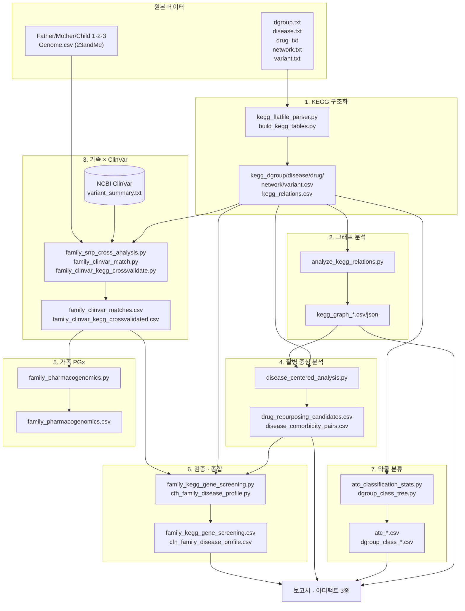

# 워크플로우

KEGG 데이터 구조화부터 가족 SNP 교차분석까지, 전체 파이프라인을 실행 순서대로 정리한다.
각 단계는 이전 단계의 출력을 입력으로 받는다 — 순서를 건너뛰면 뒤 단계가 실패한다.

## 전체 흐름



## 단계별 상세

### 0. 폴더 준비
```
KEGG_genomes_networks_diseases_and_drugs/
├── KEGG 데이터/              {data, docs, output, script}
└── 가족 유전체(SNP) 데이터/   {data, docs, output, script}
```
`*.txt` → `KEGG 데이터/data/`, `*.csv`(가족 게놈) → `가족 유전체(SNP) 데이터/data/`

### 1. KEGG 구조화
| | |
|---|---|
| 입력 | `KEGG 데이터/data/{dgroup,disease,drug ,network,variant}.txt` |
| 스크립트 | `kegg_flatfile_parser.py`(공용 파서) → `build_kegg_tables.py` |
| 출력 | `kegg_{dgroup,disease,drug,network,variant}.csv`, `kegg_relations.csv` |
| 보조 | `extract_variant_genes.py` → `variant_genes_unique.csv` |

### 2. 그래프 분석
| | |
|---|---|
| 입력 | `kegg_relations.csv`, `kegg_*.csv` |
| 스크립트 | `analyze_kegg_relations.py` |
| 출력 | `kegg_graph_type_summary.csv`, `kegg_graph_top_hubs.csv`, `kegg_graph_ego_network.json` |

### 3. 가족 SNP × ClinVar
| | |
|---|---|
| 입력 | `가족 유전체(SNP) 데이터/data/*.csv`, `kegg_disease.csv`, `kegg_variant.csv`, NCBI ClinVar `variant_summary.txt.gz`(외부 다운로드) |
| 스크립트 | `family_snp_cross_analysis.py` → `family_clinvar_match.py` → `family_clinvar_kegg_crossvalidate.py` |
| 출력 | `family_snp_summary.csv`, `kegg_disease_gene_panel.csv`, `family_clinvar_matches.csv`, `family_clinvar_kegg_crossvalidated.csv` |
| 비고 | ClinVar 원본은 GRCh37만 필터링, rsid는 가족 데이터 union(1,117,586개)만 스트리밍 매칭 |

### 4. 질병 중심 분석
| | |
|---|---|
| 입력 | `kegg_relations.csv`, `kegg_disease/drug/dgroup/network.csv` |
| 스크립트 | `disease_centered_analysis.py` |
| 출력 | `disease_pathway_genes.csv`, `drug_repurposing_candidates.csv`, `disease_comorbidity_pairs.csv` |

### 5. 가족 약물유전체(PGx)
| | |
|---|---|
| 입력 | `family_clinvar_matches.csv`, `kegg_dgroup.csv`, `kegg_drug.csv` |
| 스크립트 | `family_pharmacogenomics.py` |
| 출력 | `family_pharmacogenomics.csv`, `family_pharmacogenomics_summary.csv` |

### 6. 독립 검증 · 가족 특화 종합
| | |
|---|---|
| 입력 | `kegg_disease_gene_panel.csv`, `family_clinvar_matches.csv`, `kegg_relations.csv`, `disease_centered_analysis.py`의 함수 |
| 스크립트 | `family_kegg_gene_screening.py`, `cfh_family_disease_profile.py` |
| 출력 | `family_kegg_gene_screening.csv`, `cfh_family_disease_profile.csv` |

### 7. 약물 분류 통계
| | |
|---|---|
| 입력 | `kegg_drug.csv`, `dgroup.txt`(원본 재파싱), `kegg_dgroup.csv` |
| 스크립트 | `atc_classification_stats.py`, `dgroup_class_tree.py` |
| 출력 | `atc_top_level_summary.csv`, `atc_subgroup_summary.csv`, `dgroup_class_edges.csv`, `dgroup_class_rollup.csv` |

### 8. 산출
- 보고서: **Pathway to Pedigree** (전체 6단계 서술 + 아티팩트 2종 링크 포함)
- 시각화: **KEGG Relations Atlas**(관계 그래프), **Drug Taxonomy**(약물 분류)

## 처음부터 재현할 때 실행 순서

```
1) build_kegg_tables.py                         (KEGG 데이터/script)
2) extract_variant_genes.py                     (KEGG 데이터/script, 선택)
3) analyze_kegg_relations.py                    (KEGG 데이터/script)
4) family_snp_cross_analysis.py                 (가족 유전체(SNP) 데이터/script)
5) [ClinVar variant_summary.txt.gz 다운로드]
6) family_clinvar_match.py                      (가족 유전체(SNP) 데이터/script)
7) family_clinvar_kegg_crossvalidate.py         (가족 유전체(SNP) 데이터/script)
8) disease_centered_analysis.py                 (KEGG 데이터/script)
9) family_pharmacogenomics.py                   (가족 유전체(SNP) 데이터/script)
10) family_kegg_gene_screening.py               (가족 유전체(SNP) 데이터/script)
11) cfh_family_disease_profile.py               (가족 유전체(SNP) 데이터/script)
12) atc_classification_stats.py                 (KEGG 데이터/script)
13) dgroup_class_tree.py                        (KEGG 데이터/script)
```

각 스크립트는 이전 단계의 `output/` CSV를 그대로 읽으므로, 순서를 지키면 별도 설정 없이
그대로 재실행된다.
